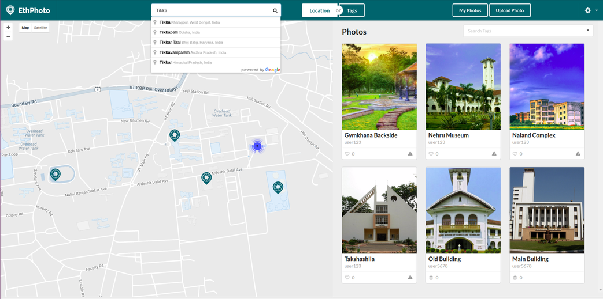
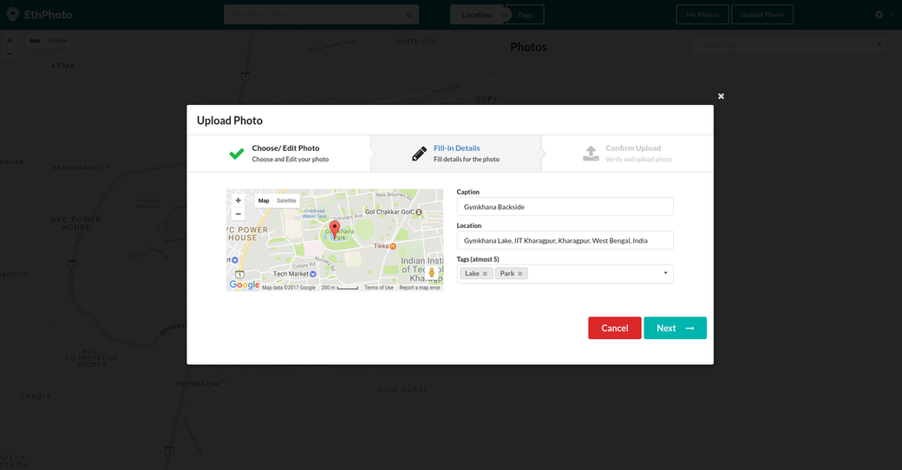

EthPhoto
===========================
Ethereum and IPFS based image sharing platform

### Dependencies 
+ Required packages to run the software - 
	- [geth](https://github.com/ethereum/go-ethereum)
	- [IPFS](https://ipfs.io/docs/install/)

+ To install the dependencies run `install-dependencies-linux.sh` script. You can also install manually by running each commands individually.

### Development Dependencies

To build the software, we need the following requirements:
- Node.js >= 6.x, NPM and the following npm packages
- Embark
- Grunt
- Bower

To install these requirements, run `build-software.sh`
To run the script file, use command: `sudo sh ./build-software.sh`

### Build from Source
* `npm install`
* `bower install`
* `grunt production`

For running the software in development, run these commands 
* Run `embark blockchain` to create a Ethereum node
* To compile the contracts, Run: `embark build`
* Run `ipfs daemon` to start new IPFS node
* Run `grunt` in another terminal window and navigate to `http://localhost:8000` using web browser.
* To run Unit tests: Run `npm test`

### Screenshots

